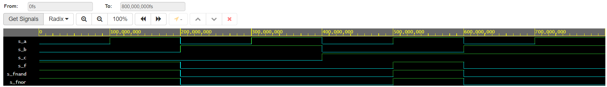

# 01 - Gates
## 1. Submit the GitHub link to repository
[repository](https://github.com/barbora-simkova/Digital-electronics-1)
## 2. Verification of De Morgan's laws of function.

```vhdl 
------------------------------------------------------------------------
-- Entity declaration for basic gates
------------------------------------------------------------------------
entity gates is
    port(
        a_i    : in  std_logic;         -- Data input
        b_i    : in  std_logic;         -- Data input
        c_i		:in std_logic;
        f_o  	: out std_logic;         -- OR output function
        fnand_o : out std_logic;         -- AND output function
        fnor_o : out std_logic          -- XOR output function
    );
end entity gates;

------------------------------------------------------------------------
-- Architecture body for basic gates
------------------------------------------------------------------------
architecture dataflow of gates is
begin
    f_o  <= ((not b_i) and a_i) or ((not c_i) and (not b_i));
 	fnand_o <= not (not (not b_i and a_i) and not(not c_i and not b_i));
    fnor_o <= not (b_i or not a_i) or not (c_i or b_i);

end architecture dataflow;
```




[Link to my public EDA Playground example](https://www.edaplayground.com/x/Z594)

## 3. Verification of Distributive laws.
