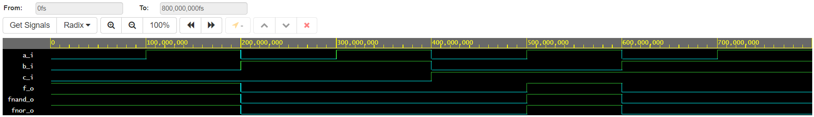

# 01 - Gates
## 1. Submit the GitHub link to repository
[repository](https://github.com/barbora-simkova/Digital-electronics-1)
## 2. Verification of De Morgan's laws of function.

```vhdl 
------------------------------------------------------------------------
--
-- Example of basic OR, AND, XOR gates.
-- Nexys A7-50T, Vivado v2020.1, EDA Playground
--
-- Copyright (c) 2019-2020 Tomas Fryza
-- Dept. of Radio Electronics, Brno University of Technology, Czechia
-- This work is licensed under the terms of the MIT license.
--
------------------------------------------------------------------------

library ieee;               -- Standard library
use ieee.std_logic_1164.all;-- Package for data types and logic operations

------------------------------------------------------------------------
-- Entity declaration for basic gates
------------------------------------------------------------------------
entity gates is
    port(
        a_i     : in  std_logic;         -- Data input
        b_i     : in  std_logic;         -- Data input
        c_i		: in std_logic;
        f_o  	: out std_logic;         -- OR output function
        fnand_o : out std_logic;         -- NAND output function
        fnor_o  : out std_logic          -- NOR output function
    );
end entity gates;

------------------------------------------------------------------------
-- Architecture body for basic gates
------------------------------------------------------------------------
architecture dataflow of gates is
begin
    f_o  <= ((not b_i) and a_i) or ((not c_i) and (not b_i));
 	fnand_o <= ((not b_i nand a_i) nand (not c_i nand not b_i));
    fnor_o <= not ((b_i nor not a_i) nor (c_i nor b_i));

end architecture dataflow;
```

| **c** | **b** |**a** | **f(c,b,a)** |
| :-: | :-: | :-: | :-: |
| 0 | 0 | 0 | 1 |
| 0 | 0 | 1 | 1 |
| 0 | 1 | 0 | 0 |
| 0 | 1 | 1 | 0 |
| 1 | 0 | 0 | 0 |
| 1 | 0 | 1 | 1 |
| 1 | 1 | 0 | 0 |
| 1 | 1 | 1 | 0 |




[Link to my public EDA Playground example](https://www.edaplayground.com/x/Z594)

## 3. Verification of Distributive laws.
