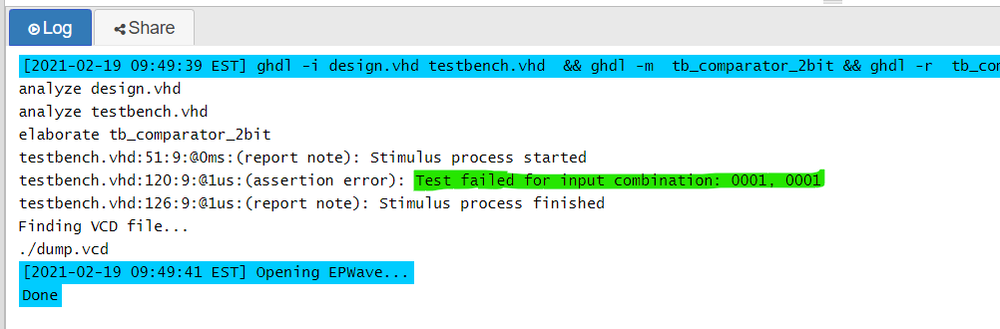

# 1. Preparation tasks
### Binary comparator truth table:

| **Dec. equivalent** | **B[1:0]** | **A[1:0]** | **B is greater than A** | **B equals A** | **B is less than A** |
| :-----------------: | :--------: | :--------: | :---------------------: | :------------: | :------------------: |
|          0          |    0 0     |    0 0     |            0            |       1        |          0           |
|          1          |    0 0     |    0 1     |            0            |       0        |          1           |
|          2          |    0 0     |    1 0     |            0            |       0        |          1           |
|          3          |    0 0     |    1 1     |            0            |       0        |          1           |
|          4          |    0 1     |    0 0     |            1            |       0        |          0           |
|          5          |    0 1     |    0 1     |            0            |       1        |          0           |
|          6          |    0 1     |    1 0     |            0            |       0        |          1           |
|          7          |    0 1     |    1 1     |            0            |       0        |          1           |
|          8          |    1 0     |    0 0     |            1            |       0        |          0           |
|          9          |    1 0     |    0 1     |            1            |       0        |          0           |
|         10          |    1 0     |    1 0     |            0            |       1        |          0           |
|         11          |    1 0     |    1 1     |            0            |       0        |          1           |
|         12          |    1 1     |    0 0     |            1            |       0        |          0           |
|         13          |    1 1     |    0 1     |            1            |       0        |          0           |
|         14          |    1 1     |    1 0     |            1            |       0        |          0           |
|         15          |    1 1     |    1 1     |            0            |       1        |          0           |

# 2. A 2-bit comparator

### Karnaugh maps for all three functions


### Simplified SoP form of the "greater than" function and simplified PoS form of the "less than" function


### Link to my public EDA Playground example in the form

https://www.edaplayground.com/x/8Rgt

# 3. A 4-bit binary comparator
### VHDL architecture

```vhdl
------------------------------------------------------------------------

library ieee;
use ieee.std_logic_1164.all;

------------------------------------------------------------------------
-- Entity declaration for 2-bit binary comparator
------------------------------------------------------------------------
entity comparator_2bit is
    port(
        a_i           : in  std_logic_vector(4 - 1 downto 0);
		b_i           : in  std_logic_vector(4 - 1 downto 0);

        -- COMPLETE ENTITY DECLARATION
        B_greater_A_o : out std_logic;      -- B is greater than A
        B_equals_A_o  : out std_logic;      -- B equals A
        B_less_A_o    : out std_logic       -- B is less than A
    );
end entity comparator_2bit;

------------------------------------------------------------------------
-- Architecture body for 2-bit binary comparator
------------------------------------------------------------------------
architecture Behavioral of comparator_2bit is
begin
    B_greater_A_o <= '1' when (b_i > a_i) else '0';
    B_equals_A_o  <= '1' when (b_i = a_i) else '0';
    B_less_A_o    <= '1' when (b_i < a_i) else '0';

end architecture Behavioral;
```


### VHDL stimulus process from testbench file

```vhdl
------------------------------------------------------------------------

library ieee;
use ieee.std_logic_1164.all;

------------------------------------------------------------------------
-- Entity declaration for testbench
------------------------------------------------------------------------
entity tb_comparator_2bit is
    -- Entity of testbench is always empty
end entity tb_comparator_2bit;

------------------------------------------------------------------------
-- Architecture body for testbench
------------------------------------------------------------------------
architecture testbench of tb_comparator_2bit is

    -- Local signals
    signal s_a           : std_logic_vector(4 - 1 downto 0);
    signal s_b           : std_logic_vector(4 - 1 downto 0);
    signal s_B_greater_A : std_logic;
    signal s_B_equals_A  : std_logic;
    signal s_B_less_A    : std_logic;

begin
    -- Connecting testbench signals with comparator_2bit entity (Unit Under Test)
    uut_comparator_2bit : entity work.comparator_2bit
        port map(
            a_i           => s_a,
            b_i           => s_b,
            B_greater_A_o => s_B_greater_A,
            B_equals_A_o  => s_B_equals_A,
            B_less_A_o    => s_B_less_A
        );

    --------------------------------------------------------------------
    -- Data generation process
    --------------------------------------------------------------------
    p_stimulus : process
    begin
        -- Report a note at the begining of stimulus process
        report "Stimulus process started" severity note;


        -- 1. test values
        s_b <= "0000"; s_a <= "0000"; wait for 100 ns;
        -- Expected output
        assert ((s_B_greater_A = '0') and (s_B_equals_A = '1') and (s_B_less_A = '0'))
        -- If false, then report an error
        report "Test failed for input combination: 0000, 0000" severity error;
        
        -- 2. test values
        s_b <= "0000"; s_a <= "0001"; wait for 100 ns;
        -- Expected output
        assert ((s_B_greater_A = '0') and (s_B_equals_A = '0') and (s_B_less_A = '1'))
        -- If false, then report an error
        report "Test failed for input combination: 0000, 0001" severity error;
        
        -- 3. test values
        s_b <= "0000"; s_a <= "0010"; wait for 100 ns;
        -- Expected output
        assert ((s_B_greater_A = '0') and (s_B_equals_A = '0') and (s_B_less_A = '1'))
        -- If false, then report an error
        report "Test failed for input combination: 0000, 0010" severity error;
        
        -- 4. test values
        s_b <= "0000"; s_a <= "0100"; wait for 100 ns;
        -- Expected output
        assert ((s_B_greater_A = '0') and (s_B_equals_A = '0') and (s_B_less_A = '1'))
        -- If false, then report an error
        report "Test failed for input combination: 0000, 0100" severity error;
        
        -- 5. test values
        s_b <= "0000"; s_a <= "1000"; wait for 100 ns;
        -- Expected output
        assert ((s_B_greater_A = '0') and (s_B_equals_A = '0') and (s_B_less_A = '1'))
        -- If false, then report an error
        report "Test failed for input combination: 0000, 1000" severity error;
        
        -- 6. test values
        s_b <= "0001"; s_a <= "0000"; wait for 100 ns;
        -- Expected output
        assert ((s_B_greater_A = '1') and (s_B_equals_A = '0') and (s_B_less_A = '0'))
        -- If false, then report an error
        report "Test failed for input combination: 0001, 0000" severity error;
        
        -- 7. test values
        s_b <= "0010"; s_a <= "0000"; wait for 100 ns;
        -- Expected output
        assert ((s_B_greater_A = '1') and (s_B_equals_A = '0') and (s_B_less_A = '0'))
        -- If false, then report an error
        report "Test failed for input combination: 0010, 0000" severity error;
        
        -- 8. test values
        s_b <= "0100"; s_a <= "0000"; wait for 100 ns;
        -- Expected output
        assert ((s_B_greater_A = '1') and (s_B_equals_A = '0') and (s_B_less_A = '0'))
        -- If false, then report an error
        report "Test failed for input combination: 0100, 0000" severity error;
        
        -- 9. test values
        s_b <= "1000"; s_a <= "0000"; wait for 100 ns;
        -- Expected output
        assert ((s_B_greater_A = '1') and (s_B_equals_A = '0') and (s_B_less_A = '0'))
        -- If false, then report an error
        report "Test failed for input combination: 1000, 0000" severity error;
        
        -- 10. test values error
        s_b <= "0001"; s_a <= "0001"; wait for 100 ns;
        -- Expected output
        assert ((s_B_greater_A = '1') and (s_B_equals_A = '0') and (s_B_less_A = '0'))
        -- If false, then report an error
        report "Test failed for input combination: 0001, 0001" severity error;
        
        
        -- Report a note at the end of stimulus process
        report "Stimulus process finished" severity note;
        wait;
    end process p_stimulus;

end architecture testbench;
```


### Listing of simulator console output, i.e. with one reported error



### Link to my public EDA Playground

https://www.edaplayground.com/x/TDqp