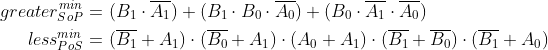

# 1. Preparation tasks
### Binary comparator truth table:

| **Dec. equivalent** | **B[1:0]** | **A[1:0]** | **B is greater than A** | **B equals A** | **B is less than A** |
| :-----------------: | :--------: | :--------: | :---------------------: | :------------: | :------------------: |
|          0          |    0 0     |    0 0     |            0            |       1        |          0           |
|          1          |    0 0     |    0 1     |            0            |       0        |          1           |
|          2          |    0 0     |    1 0     |            0            |       0        |          1           |
|          3          |    0 0     |    1 1     |            0            |       0        |          1           |
|          4          |    0 1     |    0 0     |            1            |       0        |          0           |
|          5          |    0 1     |    0 1     |            0            |       1        |          0           |
|          6          |    0 1     |    1 0     |            0            |       0        |          1           |
|          7          |    0 1     |    1 1     |            0            |       0        |          1           |
|          8          |    1 0     |    0 0     |            1            |       0        |          0           |
|          9          |    1 0     |    0 1     |            1            |       0        |          0           |
|         10          |    1 0     |    1 0     |            0            |       1        |          0           |
|         11          |    1 0     |    1 1     |            0            |       0        |          1           |
|         12          |    1 1     |    0 0     |            1            |       0        |          0           |
|         13          |    1 1     |    0 1     |            1            |       0        |          0           |
|         14          |    1 1     |    1 0     |            1            |       0        |          0           |
|         15          |    1 1     |    1 1     |            0            |       1        |          0           |

# 2. A 2-bit comparator

### Karnaugh maps for all three functions

### Simplified SoP form of the "greater than" function and simplified PoS form of the "less than" function

### Link to my public EDA Playground example in the form

https://www.edaplayground.com/x/8Rgt

# 3. A 4-bit binary comparator
### VHDL architecture

### VHDL stimulus process from testbench file

### Listing of simulator console output, i.e. with one reported error

### Link to your public EDA Playground

https://www.edaplayground.com/x/TDqp