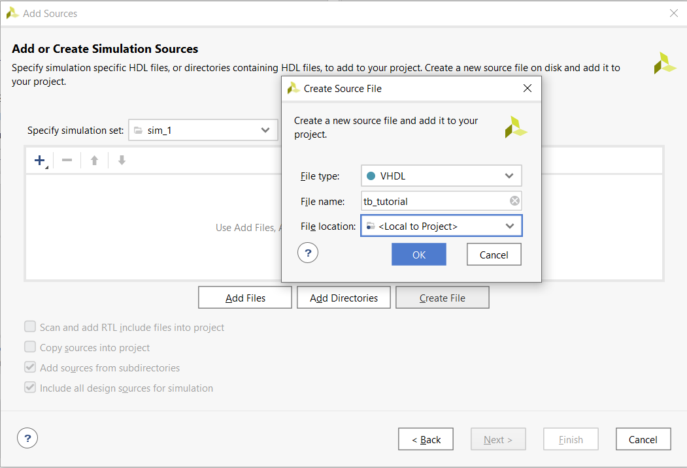

# 1. Preparation tasks 
### Table with connection of 16 slide switches and 16 LEDs on Nexys A7 board.

|   LEDs   | Connection     | Switches | Connection |
| :--: | :--: | :--: | :--: |
| LED0 | H17 | SW0 | J15 |
| LED1 | K15 | SW1 | L16 |
| LED2 | J13 | SW2 | M13 |
| LED3 | N14 | SW3 | R15 |
| LED4 | R18 | SW4 | R17 |
| LED5 | V17 | SW5 | T18 |
| LED6 | U17 | SW6 | U18 |
| LED7 | U16 | SW7 | R13 |
| LED8 | V16 | SW8 | T8 |
| LED9 | T15 | SW9 | U8 |
| LED10 | U14 | SW10 | R16 |
| LED11 | T16 | SW11 | T13 |
| LED12 | V15 | SW12 | H6 |
| LED13 | V14 | SW13 | U12 |
| LED14 | V12 | SW14 | U11 |
| LED15 | V11 | SW15 | V10 |


# 2. Two-bit wide 4-to-1 multiplexer
### Listing of VHDL architecture
```vhdl
architecture Behavioral of mux_2bit_4to1 is
begin
    f_o <= a_i when (sel_i = "00") else
           b_i when (sel_i = "01") else
           c_i when (sel_i = "10") else
           d_i;
end architecture Behavioral;
```

### Listing of VHDL stimulus process from testbench

```vhdl
p_stimulus : process
    begin
        -- Report a note at the begining of stimulus process
        report "Stimulus process started" severity note;

        s_d <= "00"; s_c <= "00"; s_b <= "00"; s_a <= "00";
        s_sel <= "00"; wait for 100 ns;
        
        s_d <= "10"; s_c <= "01"; s_b <= "01"; s_a <= "00";
        s_sel <= "00"; wait for 100 ns;
        
        s_d <= "10"; s_c <= "01"; s_b <= "01"; s_a <= "11";
        s_sel <= "00"; wait for 100 ns;
        
        s_d <= "10"; s_c <= "01"; s_b <= "01"; s_a <= "00";
        s_sel <= "01"; wait for 100 ns;
        
        s_d <= "10"; s_c <= "01"; s_b <= "11"; s_a <= "00";
        s_sel <= "01"; wait for 100 ns;
        
        s_d <= "10"; s_c <= "01"; s_b <= "11"; s_a <= "00";
        s_sel <= "10"; wait for 100 ns;
        
        s_d <= "10"; s_c <= "01"; s_b <= "11"; s_a <= "00";
        s_sel <= "11"; wait for 100 ns;
        
        s_d <= "01"; s_c <= "01"; s_b <= "11"; s_a <= "00";
        s_sel <= "11"; wait for 100 ns;
        
        s_d <= "01"; s_c <= "01"; s_b <= "01"; s_a <= "01";
        s_sel <= "01"; wait for 100 ns;
        
        s_d <= "11"; s_c <= "01"; s_b <= "11"; s_a <= "00";
        s_sel <= "11"; wait for 100 ns;
       

        -- Report a note at the end of stimulus process
        report "Stimulus process finished" severity note;
        wait;
    end process p_stimulus;
```

### Screenshot with simulated time waveforms


# 3. A Vivado tutorial
### Project creation

First option - Quick Start -> Create Project


Second option - File -> Project -> New...


Here we type name of the project and choose the directory where the project data will be stored.


Here we choose project type to RTL Project.


### Adding source file

We can add source file during the creation of the project or after the creation by following these steps:


Here we choose Add or create design sources.


Then we click on Create File, choose VHDL in column File type and fill in the File name.


### Adding testbench file

File -> Add Sources...


Here we choose Add or create simulation sources and click on Next.


Then we click on Create File, choose VHDL in column File type and fill in the File name.



### Running simulation

First option - in Flow Navigator


Second option - Flow -> Run Simulation -> Run Behavioral Simulation


### Adding XDC constraints file

File -> Add Sources...


Here we choose the first option - Add or create constrains


Then we click on Create File and choose XDC in column File type and fill in the File name.

